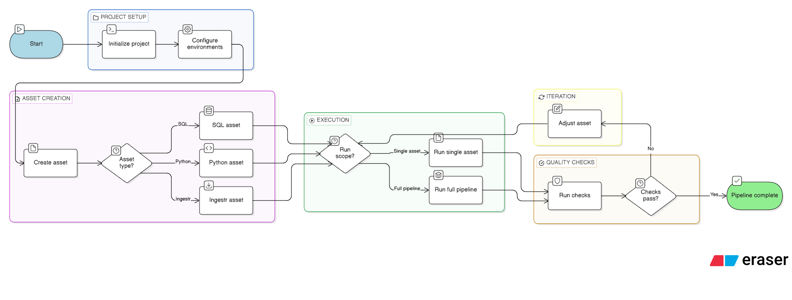

<h1 align="center">
  
  𝘽𝙧𝙪𝙞𝙣
</h1>

  

  <em>"What if Airbyte, Airflow, dbt, and Great Expectations had a lovechild?" Zoomcamp</em>

## Bruin Pipelines

Bruin is an end-to-end data platform that combines:

- ingestion
- transformation, cleaning, modeling, and aggregation with SQL, Python, and R
- orchestration, scheduling, dependency management, and pipeline run management
- governance through built-in quality checks and validation for accuracy and consistency
- metadata management, including lineage, ownership, and documentation

Bruin lets you keep code logic, configurations, dependencies, and quality checks in one place.

**Core Concepts**

- **Asset**: Any data artifact that carries value (table, view, file, ML model, etc.)
- **Pipeline**: A group of assets executed together in dependency order
- **Environment**: A named set of connection configs (e.g., `default`, `production`) so the same pipeline can run locally and in production
- **Connection**: Credentials to authenticate with external data sources & destinations
- **Pipeline run**: A single execution instance with specific dates and configuration

**Workflow**

  

